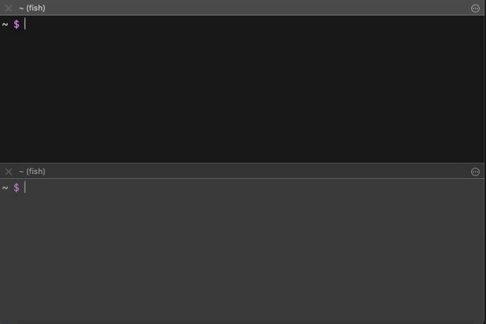

# xpx

easily connect to ...

- RDS

through fargate.



## Installation

### go install

```
go install github.com/wim-web/xpx
```

### get binary

https://github.com/wim-web/xpx/releases

## requirement

1. A public subnet must exist in the VPC to which the server you want to connect belongs.(fargate will be created in the public subnet.)
1. The security group of the server to be connected must allow connections from the public subnet.
